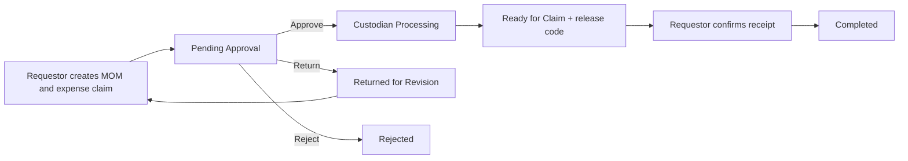
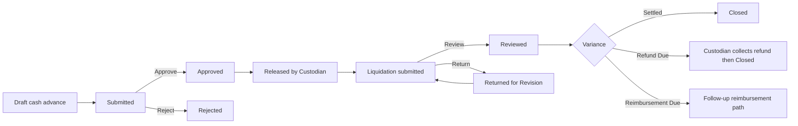
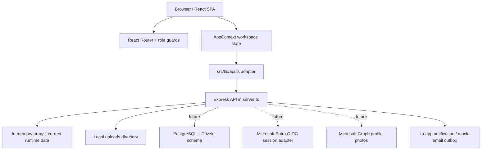
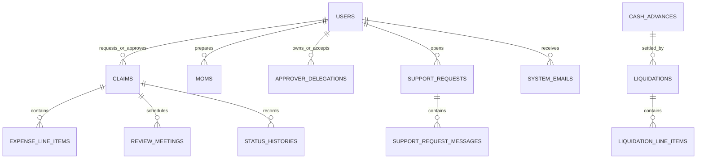

# Sales Reimbursement System

Sales Reimbursement System is a role-based web application for managing sales reimbursements, transport reimbursements, cash advances, liquidations, client meeting records, approvals, release processing, receipts, and support requests.

It is a high-fidelity **prototype and demonstration system**. Core workflows are functional against an Express backend, but the backend currently keeps data in memory and uses demo identity selection. It is not yet safe for real employee, client, or financial data.

> **Source of truth:** this README reflects the local codebase as reviewed on 2026-08-03. The current implementation takes precedence over older screenshots, historical audits, and previous GitHub snapshots.

## Contents

- [System at a glance](#system-at-a-glance)
- [Current implementation status](#current-implementation-status)
- [Roles and access](#roles-and-access)
- [User experience and navigation](#user-experience-and-navigation)
- [Business workflows](#business-workflows)
- [Architecture](#architecture)
- [Data model](#data-model)
- [Authentication, demo mode, and Microsoft](#authentication-demo-mode-and-microsoft)
- [Global search](#global-search)
- [API reference](#api-reference)
- [Local development](#local-development)
- [Testing](#testing)
- [Deployment and production cutover](#deployment-and-production-cutover)
- [Troubleshooting](#troubleshooting)
- [Handoff checklist](#handoff-checklist)

## System at a glance

### Business purpose

The system gives sales teams one place to submit, approve, disburse, and track expense-related requests. It supports the business trail from a client meeting through an expense request and payment confirmation, while preserving an activity history and notification trail.

### Transaction types

| Type | Purpose | Typical lifecycle |
|---|---|---|
| Reimbursement | Repay an employee for completed business expenses. | Draft → Pending Approval → Processing → Ready for Claim → Completed |
| Transport reimbursement | A reimbursement whose expense category/type is transport. | Same reimbursement workflow |
| Cash advance | Provide funds before a planned business expense. | Draft → Submitted → Approved → Released → Liquidated |
| Liquidation | Settle a released cash advance against actual expenses. | Draft → Submitted → Reviewed → Closed, or Returned for Revision |
| MOM / LOA | Record meeting details or an agreement supporting business activity. | Draft/Completed; may be linked to a reimbursement |

### Main capabilities

- Role-based dashboards for Requestor, Approver, Custodian, Finance, and Administrator.
- Claim submission with expense line items, receipts, client/contact information, and configurable fields.
- Minutes of Meeting (MOM) and Letter of Agreement (LOA) records, including file upload.
- Approval, rejection, revision, delegation, transfer, and stale-approver handling.
- Review meeting scheduling and response actions.
- Custodian release processing and requestor receipt confirmation using a release code.
- Cash advance and liquidation tracking, including refund and reimbursement-due outcomes.
- Receipt archive, activity history, notifications, mock email outbox, support tickets, and role dashboards.
- Administrative management for users, companies, master data, fields, reporting, imports, and audit/activity views.
- Permission-aware global search with partial, fuzzy, token, abbreviation, and keyboard support.

## Current implementation status

| Area | Status | What exists today | Before real deployment |
|---|---|---|---|
| Frontend | Implemented | React SPA with role routes, responsive layout, error/loading states, forms, dashboards, and search. | Accessibility review and final UAT. |
| Core workflows | Implemented for demo | Reimbursement, cash advance, liquidation, review meeting, delegation, release, and support flows are server-backed. | Exercise business rules against real data and policies. |
| Authentication | Demo only | Role/account launcher stores an identity per browser tab and sends `X-User-Id`. | Microsoft Entra OIDC, signed sessions, token validation, and removal of temporary identity headers. |
| Authorization | Partial / prototype | Server routes generally check the current mock identity; frontend adds route guards and scoped views. | Security review and authoritative server-side policy coverage. |
| Data persistence | Not implemented | Runtime arrays in `server.ts`; restart/cold start loses transactions. | Wire the existing Drizzle/PostgreSQL schema and migrations. |
| Demo data | Implemented | Fake users, reference data, optional automatic year seed, and admin seed/reset controls. | Set `DEMO_MODE=false` only after real identity and persistence exist. |
| Microsoft sign-in | Scaffolded | Login UI, `/api/auth/config`, config variables, and a stable `/api/auth/microsoft/start` placeholder. | OIDC adapter, Entra app registration, sessions, and callbacks. |
| Microsoft profile photos | Planned | User model has `avatar_url`; current avatars are local demo images. | Microsoft Graph permission, backend fetch/cache/proxy, fallback initials. |
| Notifications | Implemented for demo | In-app bell, outbox records, read state, and client-CC awareness messages. | Real email provider and production notification delivery. |
| Uploads | Prototype | Local disk upload endpoint; JPG, PNG, GIF, WEBP, PDF, DOC, and DOCX accepted up to 10 MB. | Durable object storage and per-resource authorization. |
| Search | Implemented | Client-side role-filtered search across claims, meetings, receipts, and support tickets. | Server-side/indexed search for large datasets. |
| Reporting | Implemented for demo | Role dashboards, analytics, activity, finance, and admin reports. | Validate metrics against the production data source. |

## Roles and access

| Role | Core responsibilities | Key access |
|---|---|---|
| Requestor | Creates and tracks their requests; confirms payment receipt. | Own claims, MOMs/LOAs, receipts, payouts, calendar, support, notifications, settings. |
| Approver | Reviews direct-report or delegated work; can submit own claims. | Approval queue, own claims, eligible team records, delegated approvals, review meetings, receipts, calendar, settings. |
| Custodian | Releases approved work and handles payment/refund processing. | Disbursement queues, ready-to-claim queue, transaction history, custodian analytics, support/settings. |
| Finance | Read-only financial visibility from approval onward. | Approved records, their receipts, paid/completed transactions, finance analytics, support/settings. |
| Administrator | Maintains the system configuration and oversight views. | Users, companies, master data, fields, imports, reporting, system activity, audit/email views, demo data while demo mode is enabled. |

Notes:

- An Approver cannot approve their own claim. Delegates can act only for active delegated approvers.
- Frontend route restrictions are in `src/App.tsx`; backend checks are in `server.ts`. Do not treat a hidden UI control as a security boundary.
- The application role is currently assigned by the internal user record. Microsoft sign-in, once implemented, should identify a user rather than automatically determine their role unless the business adopts an Entra group/app-role mapping policy.

## User experience and navigation

### Layout

The application shell consists of:

- A role-scoped sidebar for navigation and the current user identity.
- A top bar with global search, notifications, help, and a compact profile menu.
- A profile menu containing account context, Account settings, and Sign out. Sign out intentionally lives here rather than occupying top-bar space.
- Responsive cards, tables, filters, modals, pagination, empty states, confirmation dialogs, and status badges.

The primary desktop targets are **1366×768** and **1920×1080**. On narrow viewports the header search becomes an icon and opens a full-width result panel below the top bar.

### Routes

| Route | Purpose | Allowed roles |
|---|---|---|
| `/` | Role dashboard; Admin receives Admin Dashboard. | All signed-in roles |
| `/claims`, `/claims/:id`, `/claims/new` | Claim list, detail, and creation. | Requestor, Approver; Finance can view list/detail where allowed |
| `/payouts` | Requestor payout/receipt tracking. | Requestor, Approver |
| `/moms`, `/moms/new`, `/moms/:id` | Minutes and agreements. | Requestor, Approver |
| `/receipts` | Receipt archive. | Requestor, Approver, Finance |
| `/calendar` | Meetings/calendar. | Requestor, Approver |
| `/approvals` | Approval queue. | Approver |
| `/disbursements`, `/ready-to-claim` | Custodian processing queues. | Custodian |
| `/transactions` | Transaction history. | Custodian, Finance |
| `/custodian/analytics`, `/finance/analytics` | Role analytics. | Custodian / Finance respectively |
| `/notifications`, `/support`, `/settings` | Shared account/support areas. | All signed-in roles |
| `/admin/users`, `/admin/companies`, `/admin/import`, `/admin/reports`, `/admin/activity` | Administration. | Admin |

Unknown routes return to `/`. Route components below the shell are lazily loaded to reduce the initial bundle.

### Key UI source locations

| Area | Main files |
|---|---|
| Application routes and role guards | `src/App.tsx` |
| Global server-backed state | `src/components/AppContext.tsx` |
| Layout, navigation, profile, notifications | `src/components/layout/` |
| Global search | `src/components/layout/GlobalSearch.tsx`, `src/lib/globalSearch.ts` |
| Login and demo launcher | `src/pages/Login.tsx` |
| Workflow pages | `src/pages/requestor/`, `src/pages/approver/`, `src/pages/custodian/`, `src/pages/finance/`, `src/pages/shared/` |
| Admin pages | `src/pages/admin/` |
| UI primitives | `src/components/ui/` |

## Business workflows

### Reimbursement



1. A Requestor creates an expense claim, generally with a MOM/LOA context and line-item receipts.
2. The server routes it to the requestor’s approver, considering active delegation and stale-approver logic.
3. The Approver approves, returns for revision, or rejects the claim. Review meeting actions are available where applicable.
4. A Custodian processes approved work, records release/payment information, and makes it ready for claim.
5. The Requestor confirms receipt with the release code. This final confirmation is intentionally not a custodian action.

### Cash advance and liquidation



Liquidation line items calculate the total spent and variance. A `RefundDue` result requires custodian collection; a `ReimbursementDue` result can create a follow-up reimbursement path. Confirm behavior against the server before changing these rules.

### Client CC awareness

When the Requestor checks the client-CC option on a MOM/claim, a client email is required. The system records that the client was CCed and creates awareness notifications for the Requestor and Approver as applicable. Current email/outbox records are system data, not delivery through an external mail provider.

### Delegation and stale approvers

- An Approver can create a delegation for a date range; the designated delegate can accept or decline it.
- Active delegation is considered during approval visibility and routing.
- If a reporting relationship changes while a claim is pending, the system can mark the claim’s approver as stale and support transfer/reassignment paths.
- See `docs/hierarchy-sync-design.md` for the rationale and model.

### Status model

| Domain | Important statuses |
|---|---|
| Reimbursement | Draft, Pending Approval, Review Meeting Scheduled, Approved, Processing, Ready for Claim, Completed, Rejected, Returned for Revision |
| Cash advance | Draft, Submitted, Approved, Rejected, Released, Liquidated |
| Liquidation | Draft, Submitted, Returned for Revision, Reviewed, Closed |
| Review meeting | PendingConfirmation, Confirmed, DeclineRequested, Completed |
| Support | Open, In Progress, Resolved |
| Delegation | Pending, Active, Declined, Expired, Cancelled |

The client uses a unified `ClaimStatus`; the server maintains separate reimbursement, cash advance, and liquidation representations. `src/lib/api.ts` is the adapter that translates between them.

## Architecture



### Frontend-to-server model adapter

The server and UI deliberately use different domain shapes:

| Server | Frontend |
|---|---|
| Separate reimbursement claims, cash advances, and liquidations | A unified `Claim` with a `type` discriminator |
| Mostly snake_case wire fields | camelCase UI fields |
| Separate status enums | One `ClaimStatus` enum |
| Separate master-data collections | Unified frontend master-data representation |

`src/lib/api.ts` is the boundary that converts objects and statuses. Avoid adding direct raw API shape assumptions into pages; new API work should be normalized in this adapter.

### State loading and cross-tab behavior

`AppContext` loads the workspace, gates rendering while loading, exposes mutations, and periodically refreshes visible tabs. Demo identity is stored in **sessionStorage**, not a shared browser-wide store, so a presentation can keep separate Requestor, Approver, Custodian, Finance, and Admin tabs open at the same time. They share the same in-memory backend, so updates are visible after polling, focus, or refresh.

## Data model

The domain definitions are in `src/types.ts`; server wire types are in `src/serverTypes.ts`. A PostgreSQL-ready Drizzle schema exists in `src/db/schema.ts` but is not connected to the live server yet.



| Entity | Purpose |
|---|---|
| User | Employee identity, application role, org relationship, notification preferences, avatar, future Entra join keys. |
| Claim | Unified frontend view of reimbursement/cash advance/liquidation records. |
| Expense line item | Vendor, category, date, amount, payment method, business purpose, receipt, OR number. |
| MOM / LOA | Meeting/client record, contact person/designation/email, CC flag, content, source file, and custom fields. |
| Review meeting | Proposed/confirmed/declined review schedule linked to a claim. |
| Delegation | Date-bound approval delegation with acceptance state. |
| Status history | Audit-style workflow events and reasons. |
| System email | Mock outbox / in-app notification record with recipient and read state. |
| Support request | Ticket, priority, status, related entity, and message thread. |
| Company and master data | Company directory plus departments, cost centers, business units, branches, project codes, and vendors. |
| Field definition | Admin-configured dynamic fields for MOM/claim forms. |

## Authentication, demo mode, and Microsoft

### Current demo authentication

The login screen is Microsoft-first visually, but it provides demo access while Microsoft setup is pending. A user chooses a role and account, then **Open demo in new tab** creates a new sessionStorage-backed tab. There are no passwords, sessions, tokens, or real identity validation.

The API currently trusts `X-User-Id`. This is a prototype seam, not production authentication. It must be replaced before real deployment.

### Demo controls

| Variable | Default in `.env.example` | Purpose |
|---|---:|---|
| `DEMO_MODE` | `true` | Master switch for fake users/reference data, demo endpoints, seed/reset tools, and Demo Data UI. |
| `AUTH_MODE` | `demo` | Requests demo or Microsoft mode; demo mode remains authoritative while enabled. |
| `ENABLE_DEMO_LOGIN` | `true` | Enables the demo account launcher. |
| `VITE_ENABLE_DEMO_LOGIN` | `true` | Frontend-facing defense-in-depth flag. |
| `AUTO_SEED` | `true` | Seeds demonstration data at startup while demo mode is enabled. |

Set `DEMO_MODE=false` only after persistent data and real login exist. It disables fake identity/data bootstrap, demo account access, seed/reset endpoints, automatic seed, and the Admin Demo Data tab. It does **not** install a database or authenticate anyone by itself.

### Microsoft Entra ID integration status

Implemented preparation:

- `GET /api/auth/config` reports demo/Microsoft capability without exposing secrets.
- `GET /api/auth/microsoft/start` is a stable future OIDC entry point.
- User schema contains `entra_object_id` and `user_principal_name` fields.
- Login UI provides a Microsoft sign-in entry and clearly falls back to demo accounts when unconfigured.

Still required:

1. Entra tenant ID, client/application ID, approved redirect URI, secret/certificate, and assignment policy from IT.
2. Authorization-code OIDC flow with PKCE, state, nonce, issuer/audience/signature validation, and server-side session storage.
3. `HttpOnly`, `Secure`, `SameSite` session cookies, logout, expiry, and account-removal handling.
4. Lookup from validated Entra `oid` to the internal user record.
5. Removal of `X-User-Id` and per-resource upload authorization.

### Profile pictures

Profile pictures do not automatically come from Microsoft today. The current avatars are local demo files. Entra ID token claims identify a person but do not include profile-photo bytes. A production implementation should request approved Microsoft Graph photo permission, fetch a fixed-size photo such as `/me/photos/96x96/$value` through the backend, cache/proxy it to an internal `avatar_url`, and fall back to initials when no photo exists. Never place an access token or expiring Graph URL directly in an image element.

## Global search

The top-bar search is client-side and searches only records that the signed-in role is allowed to open.

| Search behavior | Details |
|---|---|
| Record types | Claims, meetings/agreements, receipt line items, and support tickets. |
| Fields | Reference, client, purpose, requester, vendor, category, receipt name/OR number, contact, status, and ticket details. |
| Matching | Case, punctuation, spacing, and accents are normalized. Terms can appear in any order. |
| Fuzzy tolerance | One typo for medium words; two for longer words; adjacent transpositions such as `jnae` → `jane`. |
| Abbreviations | `CA`, `LIQ`, `MOM`, `LOA`, `REIM`, `REQ`, and `SUPP` expand to workflow concepts. |
| Keyboard | `Ctrl+K` focuses search; arrows choose; Enter opens; Escape closes. |
| Result limit | Top 10 ranked results. |
| Scale limitation | The full workspace is already loaded in the browser. Move matching/indexing to the server for large production datasets. |

Examples: `reim 124`, `client jane`, `reimbursmnt`, `CA travel`, and `MOM client`.

## API reference

All routes are implemented in `server.ts`. Most protected routes rely on the temporary `X-User-Id` header. This table is a handoff map; inspect request validation in the corresponding route before integrating an external client.

| Area | Main endpoints |
|---|---|
| Capability/auth | `GET /api/auth/config`, `GET /api/auth/microsoft/start`, `GET /api/demo-users`, `POST /api/login`, `GET /api/me`, `PUT /api/me/notification-prefs` |
| Uploads | `POST /api/upload`, `GET /uploads/:filename` |
| Users/admin settings | `GET /api/users`, `PUT /api/users/:id`, `GET/PUT /api/admin/settings` |
| Companies/master data | `GET/POST/PUT /api/companies`, `POST /api/companies/import`, `GET/POST/PUT` master-data catalog routes, `GET/POST/PUT /api/field-definitions` |
| MOM/receipts | `GET/POST/PUT /api/moms`, `GET /api/moms/:id`, `POST /api/moms/:id/send`, `GET /api/receipts` |
| Reimbursements | `GET/POST /api/claims`, `GET /api/claims/:id`, `POST /api/claims/:id/approve`, `PUT /api/claims/:id/resubmit`, `POST /api/claims/:id/transfer-approver`, `POST /api/claims/:id/ready-for-claim`, `POST /api/claims/:id/claim` |
| Review meetings | `GET /api/review-meetings`, `POST /api/review-meetings/:id/confirm`, `POST /api/review-meetings/:id/decline`, `PUT /api/review-meetings/:id/reschedule` |
| Custodian/activity | `POST /api/custodian/claims/:id/decision`, `PUT /api/claims/:id/claim-code`, `GET /api/history`, `GET /api/system-activity`, `GET /api/activity/status`, `POST /api/activity/seen` |
| Notifications | `GET /api/outbox`, `PUT /api/outbox/read` |
| Cash advances | `GET/POST /api/cash-advances`, `GET/PUT /api/cash-advances/:id`, `POST /:id/submit`, `POST /:id/approve`, `POST /:id/release` |
| Liquidations | `GET/POST /api/liquidations`, `GET /api/liquidations/:id`, line-item create/update/delete routes, `POST /:id/submit`, `POST /:id/review`, `POST /:id/collect-refund` |
| Delegations | `GET/POST /api/delegations`, `POST /:id/accept`, `POST /:id/decline`, `POST /:id/cancel`, `PUT /api/claims/:id/reassign` |
| Support | `GET/POST /api/support`, `GET /api/support/:id`, `POST /api/support/:id/messages`, `PUT /api/support/:id` |
| Analytics/import/demo | `GET /api/analytics/summary`, `GET/POST /api/imports`, `POST /api/admin/seed`, `POST /api/admin/seed-year`, `POST /api/admin/reset` |

Demo seed/reset routes return unavailable when `DEMO_MODE=false`.

## Local development

### Prerequisites

- Node.js 18 or newer (Node 22 typings are included in development dependencies).
- npm.
- Optional: PostgreSQL only when working on the unfinished database migration.

### Start the application

PowerShell:

```powershell
cd D:\312026-Sales
npm install
npm.cmd run dev
```

Open `http://127.0.0.1:3000/` or `http://localhost:3000/`.

The development command runs `tsx server.ts`; Vite is used as Express middleware. In normal demo configuration, the server automatically seeds data unless `AUTO_SEED=false`.

### Production-style local run

```powershell
npm.cmd run build
$env:NODE_ENV = 'production'
npm.cmd start
```

Useful commands:

| Command | Purpose |
|---|---|
| `npm.cmd run dev` | Express plus Vite development server on port 3000. |
| `npm.cmd run dev:ui-only` | Vite UI only; not suitable for full backend workflows. |
| `npm.cmd run lint` | TypeScript check with `tsc --noEmit`. |
| `npm.cmd test` | Vitest test suite. |
| `npm.cmd run build` | Vite frontend build and esbuild server bundle. |
| `npm.cmd start` | Serve `dist/server.cjs`. |
| `npm.cmd run db:generate` | Generate Drizzle migrations. |
| `npm.cmd run db:push` | Push Drizzle schema when a database is configured. |
| `npm.cmd run db:studio` | Open Drizzle Studio when a database is configured. |

### Environment configuration

Copy `.env.example` into the deployment environment and set only environment-specific values. Do not commit secrets.

| Variable | Purpose |
|---|---|
| `ALLOWED_ORIGINS` | Comma-separated allowed origins when frontend and backend are separated. |
| `DEMO_MODE` | Master demo-content switch. |
| `AUTH_MODE` | `demo` or intended `microsoft` runtime mode. |
| `ENABLE_DEMO_LOGIN`, `VITE_ENABLE_DEMO_LOGIN` | Demo account launcher controls. |
| `AUTO_SEED` | Startup demo-data seed control. |
| `MICROSOFT_TENANT_ID`, `MICROSOFT_CLIENT_ID`, `MICROSOFT_CLIENT_SECRET`, `MICROSOFT_REDIRECT_URI` | Future Microsoft OIDC configuration. |
| `SESSION_SECRET` | Required once real server-side sessions are implemented. |
| `DATABASE_URL` | Required once PostgreSQL persistence is wired into the server. |
| `GRAPH_SCOPES` | Future approved Microsoft Graph scopes. |

## Testing

The project uses Vitest. At the time this README was updated, the suite contains **39 tests in 6 test files**.

| Test area | Files |
|---|---|
| API/model adapters | `src/lib/api.test.ts`, `test/api-adapters.test.ts` |
| Core reimbursement lifecycle smoke test | `test/core-loop.smoke.test.ts` |
| Analytics | `test/team-analytics.test.ts` |
| Reimbursement policy | `src/lib/reimbursementPolicy.test.ts` |
| Global search matching | `src/lib/globalSearch.test.ts` |

Run before handoff or release:

```powershell
npm.cmd run lint
npm.cmd test
npm.cmd run build
```

The tests cover important adapter, workflow, analytics, policy, and fuzzy-search behavior. They are not a replacement for role-by-role browser testing, Microsoft login testing, real database integration testing, or a security assessment.

## Deployment and production cutover

The repository contains Vercel configuration (`vercel.json`) and an API entry point under `api/`. A standard Node deployment can build with `npm run build` and start with `npm start`.

### Do not deploy with real data until all of the following are complete

1. Connect `server.ts` to PostgreSQL through the existing Drizzle schema/migrations.
2. Add backups, migration ownership, retention, and restore testing.
3. Implement Microsoft Entra OIDC and a server-side session model.
4. Remove `X-User-Id` trust and demo account access.
5. Set `DEMO_MODE=false`, `AUTH_MODE=microsoft`, `ENABLE_DEMO_LOGIN=false`, and `AUTO_SEED=false`.
6. Move uploads to durable object storage with ownership/authorization checks.
7. Replace mock email/outbox behavior with an approved email/notification provider.
8. Add structured logs, monitoring, error tracking, rate limiting, security headers/CSP review, and incident ownership.
9. Complete privacy, audit-retention, financial-control, and user-acceptance reviews.

See `docs/production-cutover.md`, `docs/microsoft-auth-handoff.md`, and `docs/DATABASE-MIGRATION.md` for focused plans.

## Troubleshooting

| Symptom | Likely cause | What to do |
|---|---|---|
| Port 3000 is busy | Another local Node process is still running. | Stop the known development server, then run the command again. |
| App opens but has no records | `AUTO_SEED=false`, demo data was reset, or demo mode is off. | Use Admin Demo Data tools only in demo mode, or restart with valid demo configuration. |
| Demo account launcher is absent | Demo mode or demo login is disabled. | Check `DEMO_MODE` and `ENABLE_DEMO_LOGIN`. |
| Microsoft sign-in reports unavailable | App registration/OIDC adapter is not implemented/configured. | Use demo access until IT supplies the registration and the adapter is built. |
| Search returns no results | Current role cannot see the data, dataset is empty, or query is unrelated. | Try a client, reference, vendor, purpose, or abbreviated workflow term. |
| Old favicon/title remains | Browser cache. | Hard refresh the affected tab. |
| Another role tab looks stale | Tabs refresh while visible/focused; backend data is shared. | Focus the tab or refresh it. |
| Upload disappears after deploy/restart | Local filesystem is not persistent. | Use durable object storage before production. |
| Type check passes but behavior is wrong | TypeScript is not in strict mode and workflow rules are server-dependent. | Run tests and exercise the actual role flow. |

## Known limitations and technical debt

| Priority | Issue | Why it matters |
|---|---|---|
| Critical | In-memory runtime data | All transactional data can disappear on restart/cold start and cannot support production. |
| Critical | Demo `X-User-Id` identity | Anyone can impersonate a role; it is not authentication. |
| High | Microsoft login is scaffolding only | No real Entra sign-in/session exists yet. |
| High | Local upload storage | Not durable or sufficiently resource-authorized for production. |
| High | Mock email/outbox | Records are generated, but external email delivery is not production-integrated. |
| Medium | Client-side workspace search | Good for demo volume; not suitable as a large-data search service. |
| Medium | Database schema is not wired | Drizzle tables/migrations exist but the Express server still uses arrays. |
| Medium | TypeScript is not strict | Green lint does not prove runtime correctness. |
| Medium | Authorization needs formal audit | Route/UI scoping should be validated against a production server-side policy. |
| Low | Historical import/import-batch behavior is evolving | Treat it as a controlled admin prototype feature until persistence and validation are complete. |

## Recommended handoff order

1. Read this README, then `docs/PROJECT-CONTEXT.md` and `docs/USER-MANUAL.md`.
2. Run the application in demo mode and open separate Requestor, Approver, Custodian, Finance, and Admin tabs.
3. Walk one reimbursement from submission to requestor receipt confirmation.
4. Review `src/lib/api.ts` before changing any API-backed page or status mapping.
5. Review `server.ts` before changing a workflow rule or permission decision.
6. Read `docs/DATABASE-MIGRATION.md`, `docs/production-cutover.md`, and `docs/microsoft-auth-handoff.md` before planning deployment work.
7. Run lint, tests, and build before making a handoff commit.

## Related documentation

| Document | Use it for |
|---|---|
| `docs/USER-MANUAL.md` | Role-by-role operational usage. |
| `docs/PROJECT-CONTEXT.md` | Historical architecture context and developer gotchas. Some statements are historical; verify against current code. |
| `docs/CURRENT-SYSTEM-AUDIT.md` | Current audit and requirement/gap analysis. |
| `docs/CHANGELOG-AND-FUTURE-WORK.md` | Delivered stakeholder changes and follow-up work. |
| `docs/production-cutover.md` | Demo-mode shutdown plan and prerequisites. |
| `docs/microsoft-auth-handoff.md` | IT inputs and implementation plan for Entra sign-in/profile photos. |
| `docs/DATABASE-MIGRATION.md` | Persistent PostgreSQL migration plan. |
| `docs/hierarchy-sync-design.md` | Approver changes, stale routing, and hierarchy model. |

## Ownership placeholders

Before an internal pilot or production deployment, assign and record:

- Business/product owner
- Technical owner
- Microsoft Entra administrator
- Database owner
- Infrastructure/deployment owner
- Financial-control and policy owner
- Support escalation contact
